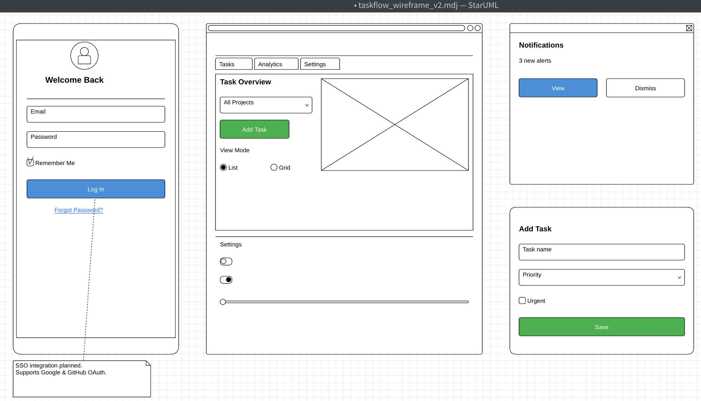
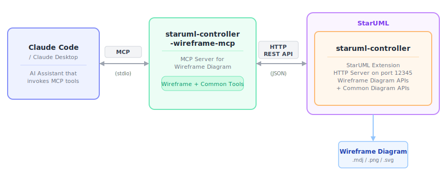

# StarUML Controller MCP Server — Wireframe Diagram

An MCP (Model Context Protocol) server specialized for **Wireframe Diagrams**. Enables AI assistants like Claude to programmatically create and manage wireframe diagrams — frames (web, mobile, desktop) and widgets (buttons, inputs, panels, images, etc.) in [StarUML](https://staruml.io/).

<p align="center">
  
</p>

## Architecture

<p align="center">
  
</p>

## Prerequisites

- **Node.js 18+**
- **StarUML** with the [staruml-controller](https://github.com/pontasan/staruml-controller) extension installed and running

## Setup

### 1. Clone and build the core package

```bash
git clone https://github.com/pontasan/staruml-controller-mcp-core.git
cd staruml-controller-mcp-core
npm install && npm run build
cd ..
```

### 2. Clone and build this package

```bash
git clone https://github.com/pontasan/staruml-controller-wireframe-mcp.git
cd staruml-controller-wireframe-mcp
npm install && npm run build
```

### 3. Start the StarUML Controller Server

1. Launch **StarUML** and open a project (or create a new one)
2. From the menu bar, select **Tools > StarUML Controller > Start Server...**
3. Enter a port (default: `12345`) and click **OK**
4. The HTTP server starts — all Wireframe Diagram tools become available via MCP

### 4. Configure your AI assistant

**Claude Code** — add to your project's `.mcp.json`:

```json
{
  "mcpServers": {
    "staruml-wireframe": {
      "command": "node",
      "args": ["/absolute/path/to/staruml-controller-wireframe-mcp/dist/index.js"]
    }
  }
}
```

Or via CLI:

```bash
claude mcp add staruml-wireframe node /absolute/path/to/staruml-controller-wireframe-mcp/dist/index.js
```

**Claude Desktop** — add to your config file:

- macOS: `~/Library/Application Support/Claude/claude_desktop_config.json`
- Windows: `%APPDATA%\Claude\claude_desktop_config.json`

```json
{
  "mcpServers": {
    "staruml-wireframe": {
      "command": "node",
      "args": ["/absolute/path/to/staruml-controller-wireframe-mcp/dist/index.js"]
    }
  }
}
```

5. Restart your AI assistant.

## Available Tools

All tools accept optional `host` (default: `localhost`) and `port` (default: `12345`) parameters.

### Wireframe Diagram Tools

The core of this server — full CRUD for every Wireframe Diagram resource.

| Resource | Tools |
|---|---|
| **Diagrams** | `wireframe_list_diagrams`, `wireframe_create_diagram`, `wireframe_get_diagram`, `wireframe_update_diagram`, `wireframe_delete_diagram` |
| **Frames** | `wireframe_list_frames`, `wireframe_create_frame`, `wireframe_get_frame`, `wireframe_update_frame`, `wireframe_delete_frame` |
| **Widgets** | `wireframe_list_widgets`, `wireframe_create_widget`, `wireframe_get_widget`, `wireframe_update_widget`, `wireframe_delete_widget` |

### Common Tools

Shared infrastructure tools available across all StarUML Controller MCP servers.

<details>
<summary><strong>General</strong> — status, elements, tags, project I/O</summary>

| Tool | Description |
|---|---|
| `get_status` | Get server status, version, and endpoint list |
| `get_element` | Get any element by ID |
| `list_element_tags` | List tags on an element |
| `create_element_tag` | Create a tag on an element |
| `get_tag` | Get tag details |
| `update_tag` | Update a tag |
| `delete_tag` | Delete a tag |
| `save_project` | Save project to a .mdj file |
| `open_project` | Open a .mdj project file |

</details>

<details>
<summary><strong>Project</strong> — new, close, import, export</summary>

| Tool | Description |
|---|---|
| `project_new` | Create a new empty project |
| `project_close` | Close the current project |
| `project_import` | Import a .mdj fragment into the project |
| `project_export` | Export a model fragment to a .mdj file |
| `project_export_all` | Export all diagrams as images (PNG/SVG/JPEG/PDF) |
| `project_export_doc` | Export project documentation (HTML/Markdown) |

</details>

<details>
<summary><strong>Utility</strong> — undo, redo, search, validate, mermaid, generate</summary>

| Tool | Description |
|---|---|
| `undo` | Undo the last action |
| `redo` | Redo the last undone action |
| `search` | Search elements by keyword with optional type filter |
| `validate` | Run model validation |
| `mermaid_import` | Import a Mermaid diagram definition |
| `generate_diagram` | Generate a diagram from natural language (requires AI extension) |

</details>

<details>
<summary><strong>Diagrams</strong> — CRUD, export, layout, zoom</summary>

| Tool | Description |
|---|---|
| `diagram_list` | List all diagrams (optionally filter by type) |
| `diagram_create` | Create a new diagram of any type |
| `diagram_get` | Get diagram details by ID |
| `diagram_update` | Update diagram name |
| `diagram_delete` | Delete a diagram |
| `diagram_list_elements` | List all elements on a diagram |
| `diagram_list_views` | List all views on a diagram |
| `diagram_create_element` | Create a node element on a diagram |
| `diagram_create_relation` | Create a relation between elements |
| `diagram_export` | Export diagram as image (PNG/SVG/JPEG/PDF) |
| `diagram_layout` | Auto-layout diagram with configurable direction |
| `diagram_open` | Open/activate a diagram in the editor |
| `diagram_zoom` | Set diagram zoom level |
| `diagram_create_view_of` | Create a view of an existing model on a diagram |
| `diagram_link_object` | Create a UMLLinkObject on an object diagram |

</details>

<details>
<summary><strong>Notes & Shapes</strong> — notes, note links, free lines, shapes</summary>

| Tool | Description |
|---|---|
| `note_list` | List all notes on a diagram |
| `note_create` | Create a note with text and position |
| `note_get` | Get note details |
| `note_update` | Update note text |
| `note_delete` | Delete a note |
| `note_link_list` | List all note links on a diagram |
| `note_link_create` | Create a link between a note and an element |
| `note_link_delete` | Delete a note link |
| `free_line_list` | List all free lines on a diagram |
| `free_line_create` | Create a free line on a diagram |
| `free_line_delete` | Delete a free line |
| `shape_list` | List all shapes on a diagram |
| `shape_create` | Create a shape (Text, TextBox, Rect, RoundRect, Ellipse, Hyperlink, Image) |
| `shape_get` | Get shape details |
| `shape_update` | Update shape text |
| `shape_delete` | Delete a shape |

</details>

<details>
<summary><strong>Views & Elements</strong> — positioning, styling, element management</summary>

| Tool | Description |
|---|---|
| `view_update` | Move/resize a view (left, top, width, height) |
| `view_update_style` | Update visual style (fillColor, lineColor, fontColor, fontSize, etc.) |
| `view_reconnect` | Reconnect an edge to different source/target |
| `view_align` | Align/distribute multiple views |
| `element_update` | Update any element's name and documentation |
| `element_delete` | Delete any element by ID |
| `element_list_relationships` | List all relationships of an element |
| `element_list_views` | List all views of an element across diagrams |
| `element_relocate` | Move element to a different parent |
| `element_create_child` | Create a child element (attribute, operation, etc.) |
| `element_reorder` | Reorder element within parent (up/down) |

</details>

## Related Projects

This server is part of the **StarUML Controller MCP** family:

| Server | Diagram Type |
|---|---|
| staruml-controller-erd-mcp | Entity-Relationship Diagram |
| staruml-controller-seq-mcp | Sequence Diagram |
| staruml-controller-class-mcp | Class / Package Diagram |
| staruml-controller-usecase-mcp | Use Case Diagram |
| staruml-controller-activity-mcp | Activity Diagram |
| staruml-controller-bpmn-mcp | BPMN Diagram |
| staruml-controller-sysml-mcp | SysML Diagram |
| [and 18 more...](https://github.com/pontasan/staruml-controller-mcp) | |

All servers share common tools and add diagram-specific tools on top. Install only what you need.

## License

MIT
